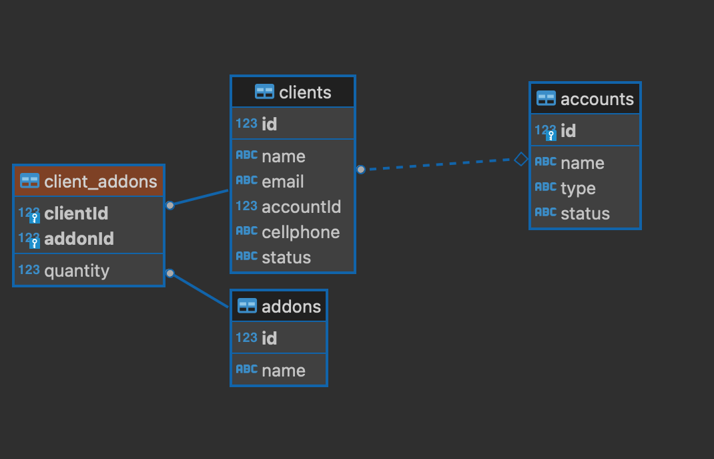
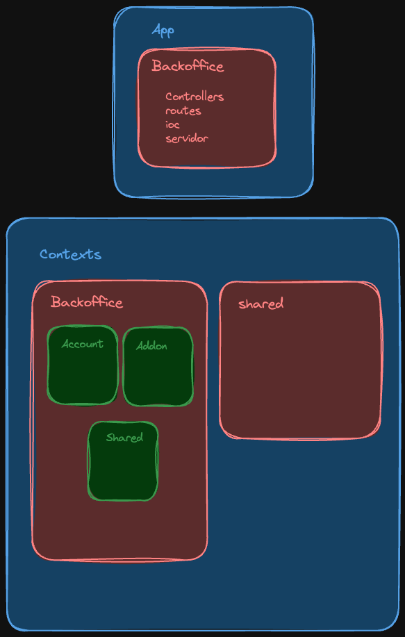

## Descripción
Una empresa que ofrece servicios de suscripción desea gestionar cuentas de tipo wellness y health. Cada cuenta puede tener múltiples clientes asociados, y es necesario que la suscripción de la cuenta esté activa para permitir la ejecución de cualquier acción relacionada con esa cuenta. Los addons (como envíos de emails o SMS) pertenecen a los clientes individuales, no a las cuentas.

Cada cliente debe tener también una suscripción activa para poder realizar acciones relacionadas con los addons asignados. Esto implica que tanto la cuenta como los clientes asociados deben estar en estado activo para poder usar las funcionalidades del sistema (crear, modificar o eliminar addons, por ejemplo).


Relaciones Clave:

1. Cuentas:

-  Pueden tener múltiples clientes asociados.
- Necesitan tener una suscripción activa para permitir la gestión de clientes y addons.

2. Clientes:

- Pertenecen a una cuenta.
- Cada cliente debe tener su propia suscripción activa para realizar acciones (p.ej., gestionar addons como email o SMS).

3. Addons:

-  Los addons, como envíos de email o SMS, están relacionados con los clientes, no con las cuentas.
- Los addons permiten gestionar el consumo y las cantidades base de cada tipo.

## Cambios del modelo


Se propone el siguiente modelo





**NOTA:** *Esto debido a que los addons al tener una implementación concreta (envío de notificaciones) se tiene que manejar de una manera más detallada, con el fin de que tanto la bd como la funcionalidad estén sincronizadas*

## Implementación de la arquitectura hexagonal




Esta arquitectura separa la parte de la aplicación con la lógica, en primero lugar se crea un componente llamado `app` donde está alojado todo el tema del servidor, aplicación, rutas y controladores, ya que estas no dependen netamente de la lógica de negocio.
Por otra parte se crea el componente `context` donde irían todos los contextos de la aplicación, para este caso solo se usó el contexto de backoffice ya que estaba relacionado con la gestión de cuentas y usuarios, cada contexto va a tener submódulos que representan entidades de negocio, cada entidad de negocio tiene todo lo que necesita para funcionar (las capas de la arquitectura `infraestructura`, `dominio`, `aplicación`)

Para este caso se crea el submódulo de `Account` y `Addon`, esto se hace ya que según la regla de negocio un cliente no puede existir si no existe una cuenta, por ende se trató la cuenta como una agregado raíz, y los clientes como entidades que dependen de la cuenta, esto implica que todas las operaciones relacionadas con el cliente tienen que pasar primero por la cuenta y es esta la única forma que tenemos para acceder a los clientes

## Cómo ejecutar el proyecto

Se debe tener creada una base de datos de postgres

```
docker run --name bewe-postgres -p 5432:5432 -e POSTGRES_PASSWORD=abc123 -e POSTGRES_USER=root -d postgres
```

Se debe agregar el .env en la raíz del proyecto
 ```
PORT=3001
DB_HOST=localhost
DB_USER=root
DB_PASSWORD="abc123"
DB_NAME=postgres
DB_PORT=5432
```


Se debe ejecutar el servidor

* desarrollo
  
  ```
  npm run dev:backend
  ```


* Producción
  
  ```
  npm run build && npm run start:backend
  ```
  
